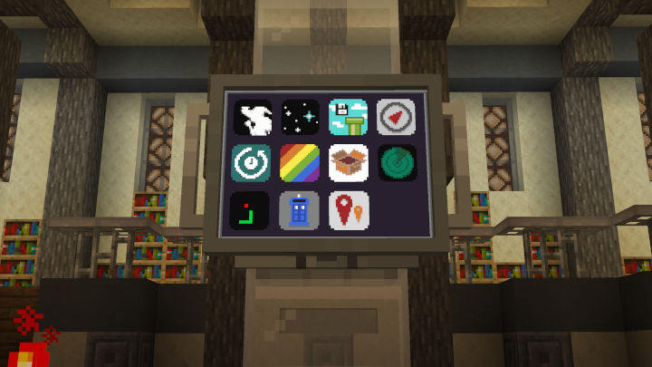

## Overview

A new take on the often-made Minecraft TARDIS mod, 
this mod aims to redesign everyone's favorite Doctor Who inspired space-time transport method and mobile base from the ground up, 
taking things in a different direction compared to other mods of its kind to hopefully provide more immersive and enjoyable gameplay.

> Check out [the Wiki](https://minitardis.enjarai.dev/)!

## You are in control...

...for better or for worse. Your TARDIS is a complex machine with many moving parts,
it is up to you to get to where you're supposed to, cause the machine won't do it for you.
This means no arbitrary flight timers or "press button x" minigames.
Every control has multiple uses and interplays with other controls to create more complex interactions,
though ultimately, they are always internally consistent.

## Got any games on your phone? Yes actually!

An essential part of your TARDIS, the TDoS interface provides critical flight information, 
databank access, an external scanner, and even multiple games 
available as apps found on floppy disks around your world.
Navigable with a simple touch screen interface, it gives you more control than ever, and more importantly, 
makes your mobile base a fun place to be for everyone involved.

## An all-in-one mobile base!

With practically infinite space to work with, your TARDIS makes the perfect mobile base!
Though you may need to clear out some of the internal plating to make room.

With the interior being fully customizable, this of course also extends to the console, 
all controls being custom blocks that work anywhere inside the TARDIS.
You can even make a second console room, or a third!

An advanced architectural reconfiguration is coming soon™ to make large scale internal reconstruction easy.

## Dramatic systems malfunctions

If you mess up, you'll at the very least do so in style.

## Credits

Bad Apple compressed file format was done by [Benonardo](https://github.com/Benonardo).

The included Snake game was made by [Louis](https://github.com/Dev0Louis).

This mod wouldn't be possible in the way it is without many of the libraries 
by [Patbox](https://github.com/Patbox) and [NucleoidMC](https://github.com/NucleoidMC).

