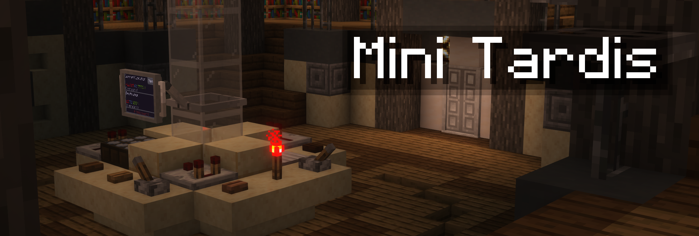
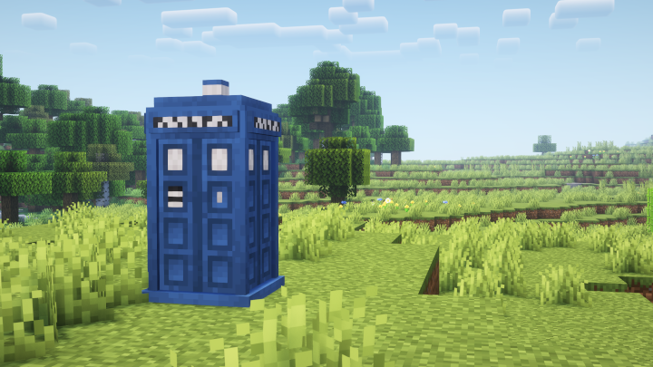

## Overview

A new take on the often-made Minecraft TARDIS mod, 
this mod aims to redesign everyone's favorite Doctor Who inspired space-time transport method and mobile base from the ground up, 
taking things in a different direction compared to other mods of its kind to hopefully provide more immersive and enjoyable gameplay.

## You are in control...

...for better or for worse. Your TARDIS is a complex machine with many moving parts,
it is up to you to get to where you're supposed to, cause the machine won't do it for you.
This means no arbitrary flight timers or "press button x" minigames.
Every control has multiple uses and interplays with other controls to create more complex interactions,
though ultimately, they are always internally consistent.

## Got any games on your phone? Yes actually!

An essential part of your TARDIS, the TdOS interface provides you with critical flight information, 
databank access, an external scanner, and even multiple games 
available as apps found on floppy disks around your world.
Navigable with a simple touch screen interface, it gives you more control than ever, and more importantly, 
makes your mobile base a fun place to be for everyone involved.

