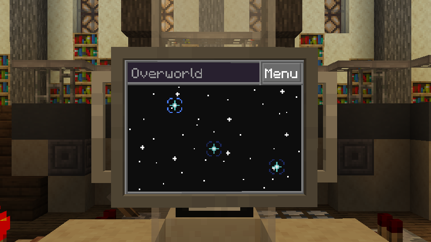

# Dimensions

The Dimensions app keeps a record of the inter-spatial coordinates of every dimension you've visited,
helping you quickly target any one you've visited before.

When you land inside an unknown dimension, the app will provide an "Add" button near the top-right of the interface.
This will triangulate the coordinates of the dimension and store them inside the app, 
adding a new selectable star to the interface.

In the case that it is not possible to enter a dimension using your TARDIS, 
an alternative option is to install the app onto a floppy and take it with you to the desired dimension.
Right-clicking the floppy while in a new dimension will register it to the app, as can be verified on the tooltip.

> (Dev note: This is a temporary method until we figure out something nicer)

This app can be found randomly generated in dungeon chests and similar places.

!!! note

    All dimensional features of the TARDIS are fully compatible with modded dimensions.