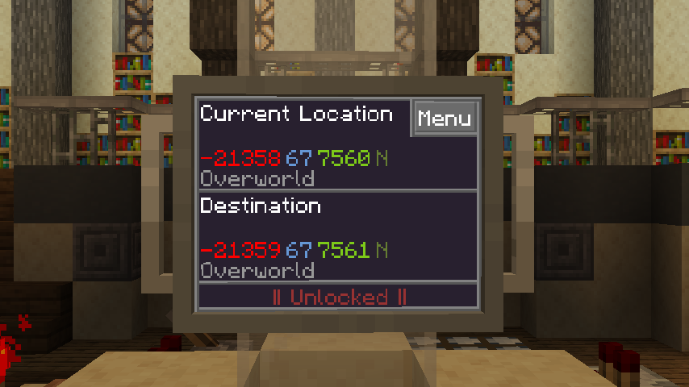

# GPS

This app simply provides an overview of the current location, destination, and target lock status of the TARDIS.
As with other places in the TdOS UI, the x, y, and z axes are represented with red, blue, and green respectively.

This app is installed by default on any new TARDIS.

!!! note

    You may notice that during flight, your current location, while gone, still has a dimension property.
    This is because some [extra steps](../basics/flying_a_tardis_101.md#addendum-interdimensional-travel) 
    are required to travel between dimensions.