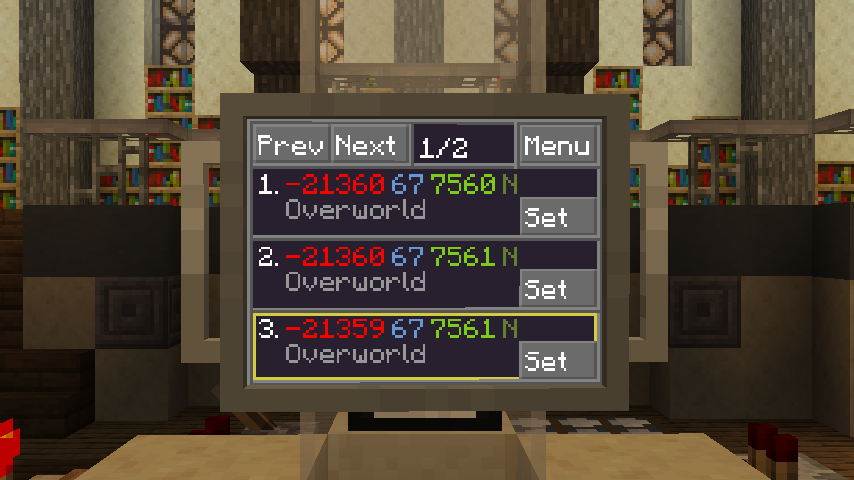

# Past Locations

This app keeps track of all locations your TARDIS has landed at in the past,
letting you easily reselect them as a destination to return to.

Locations are sorted in chronological order from newest to oldest.
Multiple pages can be browsed using the buttons in the top-left, 
and a desired destination can be selected using the "Set" button.

As with other places in the TdOS UI, the x, y, and z axes are represented with red, blue, and green respectively.

This app is installed by default on any new TARDIS.

!!! note

    The locations shown by this app are stored in its localized memory.
    This means that if the app is moved to another TARDIS by floppy, it will keep all the stored locations.
    A consequence of this is that if a TARDIS does not have this app installed, 
    *it will not keep track of its history in any way.*