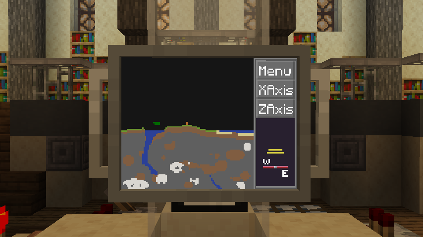

# Terrain Scanner

The Terrain Scanner app uses the builtin scanning equipment of your TARDIS 
to render a multi-axis map of your surroundings.
This map will display a sizable area around your selected destination, 
letting you plot your route in advance more effectively and avoid any potential hazards.

It is possible to switch between the X and Z axis using the sidebar buttons, 
which will be reflected by the widget in the bottom-right.
This widget displays your currently selected axis and the target facing direction of your TARDIS.

This app can be found randomly generated in dungeon chests and similar places.

!!! tip

    The target position of your TARDIS will appear as two orange blocks on the scanner.
    The TARDIS might not land at that exact location, as landing requirements are quite strict,
    but will attempt to be as close as possible.