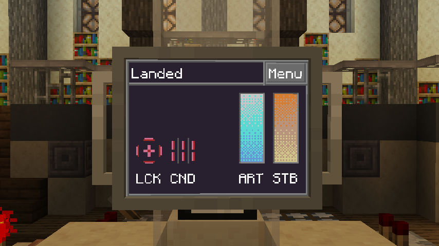

# Status

All immediately flight-relevant information will be available in this app.
This includes many constant factors, such as:

- Fuel level
- Stability level
- Current flight state
- Target lock status
- Conduit lock status

Some additional information may be displayed during a specific flight state, including:

- Error correction widgets during flight
- A drifting helper during interdimensional drifting
- An ETA until full when refueling

This app is installed by default on any new TARDIS.

