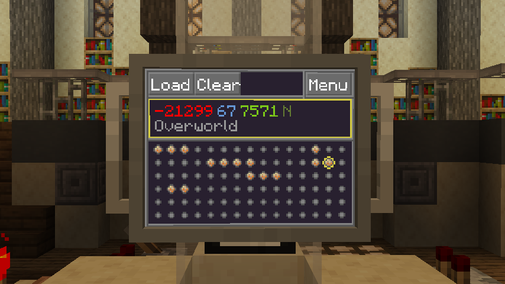

# Waypoints

The Waypoints app can be used to store and retrieve many locations you've previously visited in an orderly manner.
It provides a matrix of 90 slots, each capable of storing one location.

When selecting a slot, it will provide a "Save" button. Clicking this will set the slot to your current destination.
It can then be loaded and reset using the "Load" and "Clear" button respectively.

This app can be found randomly generated in dungeon chests and similar places. 
Waypoint apps found in this manner might even contain some old waypoints from their previous owner, 
which could be worth checking out.

!!! tip

    The Waypoints app stores its waypoints in the app itself, independent from the usual TARDIS memory banks.
    This means it is possible to transfer waypoints from one TARDIS 
    to another by moving an existing waypoints app with a Floppy Disk.