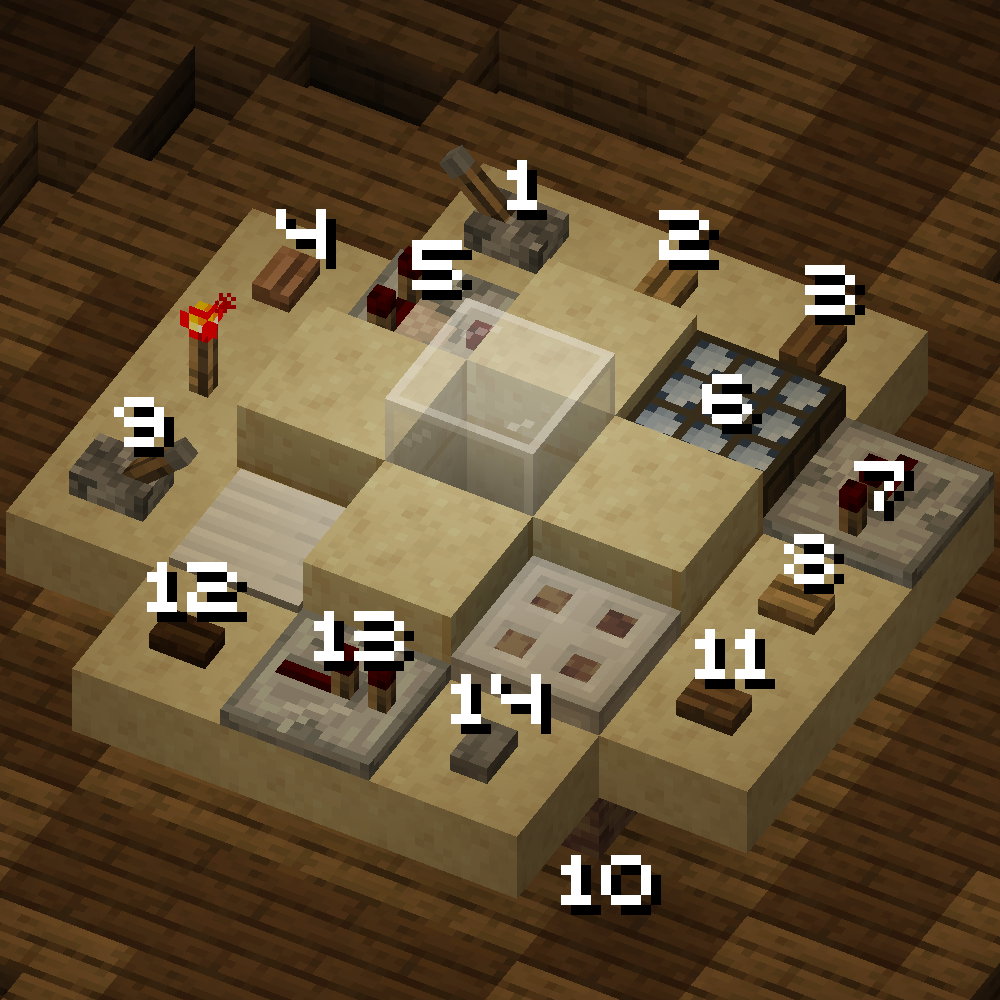
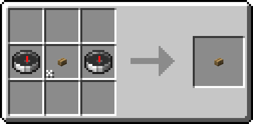
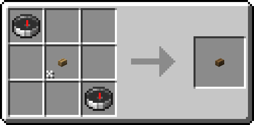
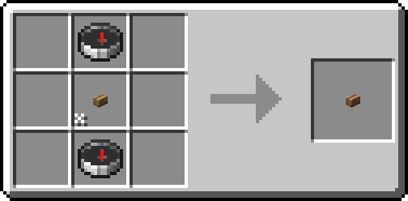
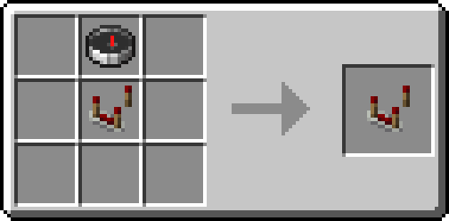
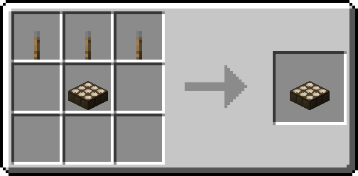
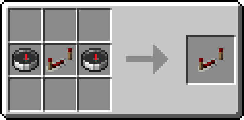
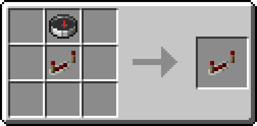
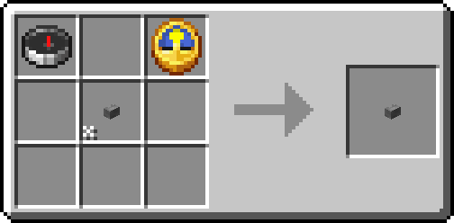

# Console Layout

While the TARDIS console is fully reconfigurable, you will probably want to use the standard layout to begin with.
This page names and explains these controls. 

All controls are included with every TARDIS by default, 
but recipes to craft additional copies/replacements are also included on this page. 

For ease of use ingame, you may want to install a mod like [Polydex] (server-side) or [WTHIT] (client-side),
as these will be able to identify controls for you at a glance.

[Polydex]: https://modrinth.com/mod/polydex
[WTHIT]: https://modrinth.com/mod/wthit

## Layout

1. [Artron Scoop Activator](#artron-scoop-activator)
2. [Target Localization Corrector 1](#target-localization-corrector) (Negative X)
3. [Target Localization Corrector 2](#target-localization-corrector) (Positive X)
4. [Lateral Target Localization Corrector](#lateral-target-localization-corrector)
5. [Lateral Targeting Selective State Switch](#lateral-target-localization-corrector)
6. [Artron Conduit Controller](#artron-conduit-controller)
7. [Localization Scale Interpreter](#localization-scale-interpreter)
8. [Target Localization Corrector 3](#target-localization-corrector) (Negative Z)
9. [Handbrake](#handbrake)
10. [Power Coupling](#power-coupling) (Under the trapdoor)
11. [Target Localization Corrector 4](#target-localization-corrector) (Positive Z)
12. [Space-time Destination Reset Switch](#space-time-destination-reset-switch)
13. [Centrifugal Facing Modifier](#centrifugal-facing-modifier)
14. [Space-time Target Lock-in](#space-time-target-lock-in)

## Detailed Reference

### Artron Scoop Activator

Toggles refueling mode, can only be activated when the TARDIS is landed 
and [Artron Conduits](#artron-conduit-controller) are turned off.

Refueling mode slowly refills the artron batteries of the TARDIS over time, which are used up during flight.

??? abstract "Recipe"

    

### Target Localization Corrector

These buttons are used to offset your target destination in their assigned directions.
They are intended to be used in conjunction with the [Scale Interpreter](#localization-scale-interpreter) 
to easily cover larger distances.

To modify your destination vertically, use the [Lateral Target Localization Corrector](#lateral-target-localization-corrector).

??? abstract "Recipes"

    
    

### Lateral Target Localization Corrector

This button is used in conjunction with the adjacent state switch to move your destination on the Y axis.
When the state switch is disabled, pressing the corrector will snap your destination to the next 
valid landing spot directly below the current destination.
Having the state switch enabled does the exact same thing, except moving up instead of down.

??? abstract "Recipes"

    
    

### Artron Conduit Controller

This toggle has to be activated as a prerequisite for taking off, but will, 
while active, also constantly drain a slight amount of artron energy.

Deactivating Artron Conduits while already in flight will let your TARDIS enter suspended flight mode,
massively reducing fuel consumption while still staying in the time vortex.

??? abstract "Recipe"

    

### Localization Scale Interpreter

Configures the coordinate scale used by [Target Localization Correctors](#target-localization-corrector).
Setting to state 1, 2, 3, and 4 will apply a scale of 1, 10, 100, and 1000 respectively.

??? abstract "Recipe"

    

### Handbrake

This lever triggers both takeoff and landing sequences.

Also used in interdimensional drifting.

??? abstract "Recipe"

    

### Power Coupling

The Power Coupling can be used to completely turn off your TARDIS, or reboot it in case of critical systems failure.

??? abstract "Recipe"

    

### Space-time Destination Reset Switch

Using this button will set your destination back to your current location.

??? abstract "Recipe"

    

### Centrifugal Facing Modifier

A quad-state switch that can be used to change the facing of your TARDIS after landing.

??? abstract "Recipe"

    

### Space-time Target Lock-in

This button can be toggled on to lock your current target destination. 
Your destination must be locked to be able to take off.

Unlocking your destination mid-flight also has several uses, 
including mid-flight course correction and interdimensional drifting.

??? abstract "Recipe"

    