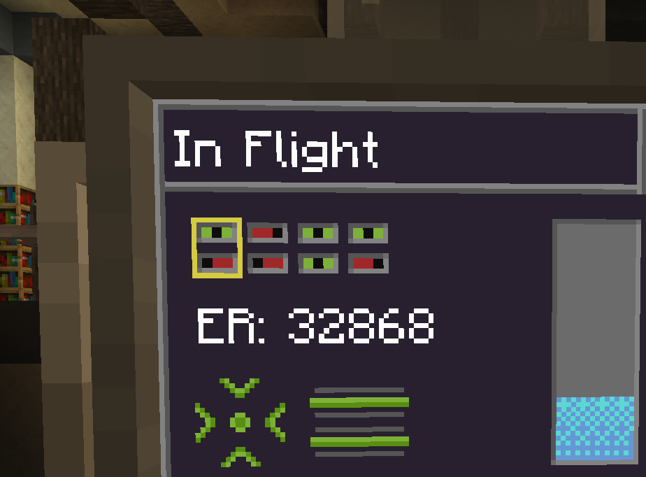
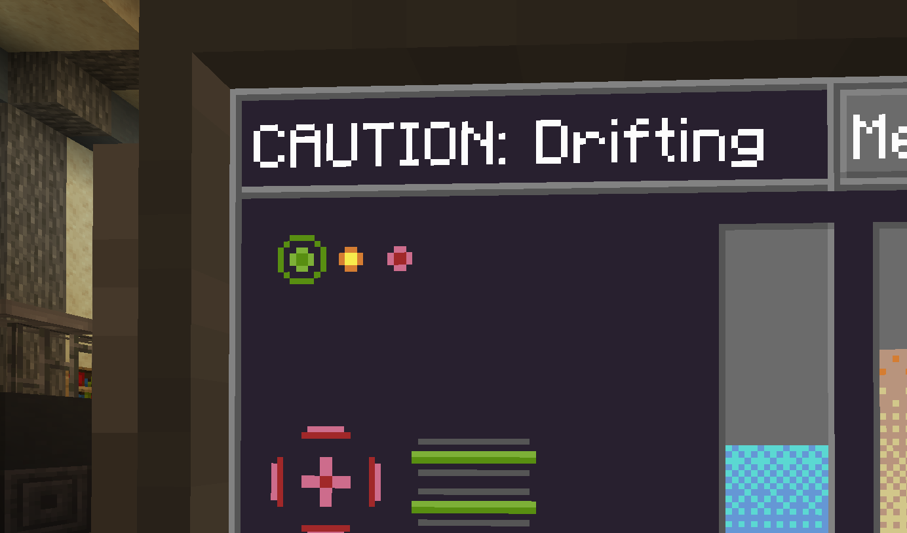

# Flying a TARDIS 101

The primary function of a TARDIS is, of course, travel. In order to travel from one place to another, your TARDIS
must first dematerialize, travel the time vortex, and then rematerialize at a set destination.
This page is intended to serve as a non-comprehensive guide for these operations,
and should provide a complete enough overview to safely traverse your first flight.

## Locating your destination

To select a landing location, make use of the [GPS] app and [Localization Corrector] buttons. 
A conventional console will have two opposite facing sets of these for horizontal modifications, 
plus one additional [Lateral Corrector] connected to a state switch for vertical control.

The GPS app will show you your current location in the world and selected destination.
Each corrector will nudge your destination a certain amount of blocks in one cardinal direction, 
dependent on the value your [Scale Interpreter] is set to. 

The lateral corrector functions a little differently, as instead of moving in X block increments, 
it snaps to the nearest valid landing spot in the current vertical column.
This lets you easily target caves or floating structures as your destination.
The direction it moves in is dependent on the attached state switch (the comparator-looking thing).

!!! note

    Whilst this is all possible to do during flight, 
    setting and verifying your destination beforehand is usually recommended
    to prevent potentially stressful situations and reduce energy usage from being dematerialized.

!!! tip
    
    If you have access to the [Terrain Scanner] app, you can use that to verify and fine-tune your landing location.

[GPS]: # (TODO)
[Localization Corrector]: console_layout.md#target-localization-corrector
[Lateral Corrector]: console_layout.md#lateral-target-localization-corrector
[Scale Interpreter]: console_layout.md#localization-scale-interpreter
[Terrain Scanner]: # (TODO)

## Pre-flight Checklist

Before taking off you'll want to run through a quick checklist to ensure a safe trip. 
All immediately flight-relevant information is shown in the [Status] app.

- Artron capacitors should be over ~25% charged.
- Preferably, ensure your stability gauge is full.
- If possible, use your terrain scanner to verify landing zone safety. 
  (Your TARDIS *can and will* happily land inside a lake of lava or on the ocean floor)

!!! tip

    You can recharge your artron capacitors by switching to refueling mode while landed.
    Make sure your [Artron Conduits] are closed and activate the [Artron Scoop] to engage the refueling process.

    **Artron energy is everywhere, and thus, essentially free!** It might take a while to gather though.

[Status]: # (TODO)
[Artron Conduits]: console_layout.md#artron-conduit-controller
[Artron Scoop]: console_layout.md#artron-scoop-activator

## Taking off

At this point, you should be ready for take-off!
First, lock in your destination using the [Target Lock-in] button. This will prevent you from modifying it, 
and is required for both the take-off and landing sequence.

Your [Artron Conduits] must also be open to provide energy to the time rotor.
While active, these will constantly slightly drain your energy supply due to minor transfer inefficiencies,
so leaving them enabled constantly, while possible, is not practical.

After activating these two controls and verifying both are green on the [Status] app, 
pull the [Handbrake] to engage flight! Once you do this, 
your TARDIS will start the take-off sequence and will enter flight soon after.

!!! tip

    You can safely unlock and modify your destination, and use many other TARDIS controls once 
    you're fully dematerialized, allowing for last minute course corrections.

[Target Lock-in]: console_layout.md#space-time-target-lock-in
[Handbrake]: console_layout.md#handbrake

## Travel and Landing

Unlike some other iterations, this model TARDIS does not require any time to travel, 
nor does it have random buttons to press to stay stable.
Instead, it requires you to use the [Localization Corrector] buttons to correct **Error** while in flight.
In short, Error will make your landing location inaccurate, 
potentially offsetting it by its current value in any direction.
As such, you'll almost always want your Error to be zero before landing.

While in flight, the current Error value along with the correction hud are shown in the [Status] app.
Each vertical set of switches in the correction hud correspond to a position on the [Scale Interpreter],
the currently selected one being highlighted.
The more of these switches are centered and thus green, the smaller your Error will be.

The state of the correction switches can be changed by selecting a set and using the [Localization Corrector] buttons,
each set of buttons able to shift one of the switches. 
This might seem complex, but once understand how it works, It's really quite simple.

Once your error reaches zero or a value you're sufficiently happy with, 
pull the [Handbrake] again at any time to initiate a landing.

!!! warning

    After landing, don't forget to disengage your conduits, lest you end up with an empty tank before your next flight!

!!! tip

    Accumulated Error can sometimes be used to your advantage, as it can safely land you in a random faraway location.

## Addendum: Interdimensional Travel

Once you acquire the [Dimensions] app, you'll be able to easily travel between dimensions using your TARDIS. 
This does however come with a few additional complexities.

For one, the Dimensions app does not have access to all dimensions by default, 
they have to be manually registered to its memory for the TARDIS to be able to travel to them at will.
This can be achieved either by using the 'Add' button inside the app while already having a different dimension targeted,
or by loading the app onto a floppy and interacting with it inside the dimension. (Temporary method)
Once a dimension is added, clicking its star inside the app will set your destination to use that dimension.

Additionally, to actually travel to a different dimension, you must temporarily destabilize your conduit through the 
time vortex in a controlled manner and enter a "drifting" state.
This can be achieved by unlocking your destination mid-flight, and pulling the handbrake as if trying to land.

Upon entering a drifting state, you'll quickly hear a bell sound, 
this is the TARDIS attempting to assist your uncontrolled travel.
For every bell sound you hear, pull the Handbrake **once**.
After a certain amount of repetitions, you will hear a confirmation and be automatically returned to stable flight, 
now within your selected dimension, after which you'll be able to land like normal.

The [Status] app helpfully provides a visual indicator for the amount of repetitions required while drifting.

!!! warning

    While in a drifting state, your TARDIS will very rapidly lose stability. 
    Once your stability reaches zero, you will enter a [Crashing] state.
    **This should be avoided if at all possible.**

[Dimensions]: # (TODO)
[Crashing]: # (TODO)
