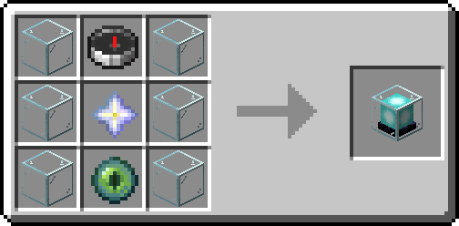
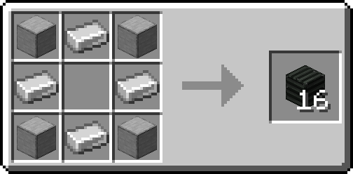

# Getting Started

In the event that you get stuck on a **new world** without your trusty TARDIS, 
you may have to locate a new one. Since it is definitely not possible to 
construct a Model 82-4 TARDIS using only the resources found on such a world, 
you will have to use unconventional means to obtain it.

## Attracting a TARDIS

One thing you are able to make use of is the tendency for trajectories of ships travelling the time vortex to intersect.
By constructing a rudimentary vessel to enter the time vortex, 
you stand a good chance of being picked up by a stray timeship. 
Once inside, it should be trivial for any sufficiently trained individual to safely rematerialize their new TARDIS.

Blueprints for a basic vessel capable of entering the time vortex are displayed below, 
using materials most likely to be available on any **new world**.

### Recipes

Start by constructing some base components, including a **Makeshift Tardis Engine**, **Handbrake**,
and about half a stack of **Tardis Plating**

### Construction

Once you've collected these materials, you'll be able to construct your makeshift TARDIS.
See the blueprint below for instructions. 

!!! warning

    The beacon and lever looking blocks in 
    this blueprint are actually the Makeshift Engine and Handbrake respectively.
    Using a vanilla beacon and/or lever here **will not work**.

!!! note
    
    The console of your makeshift TARDIS (made of Birch Stairs in this blueprint) can be made of any block.

