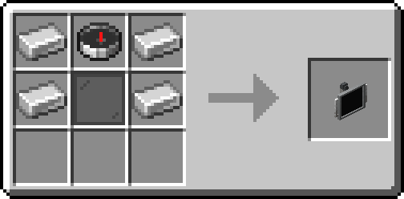
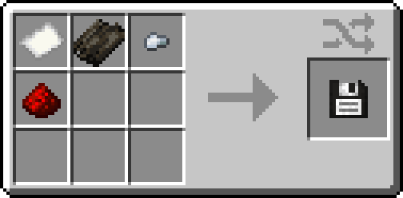

# Screen

Every Model 82-4 TARDIS comes with a preinstalled screen running TdOS,
the leading operating system for TARDIS operation, flight information, and entertainment.
The information and functionality provided by this screen is essential in properly flying your TARDIS.

!!! note
    
    Alternative versions of this screen will be added in the future to better suit different interior designs.

## Functionality

The default Console Screen can be interacted with like a touch screen by right-clicking,
and comes with 4 preinstalled apps:

- [GPS]
- [Past Locations]
- [Package Manager]
- [Status]

Additional apps can be installed by inserting a [Floppy Disk] 
into the bottom of the screen and opening the Package Manager app.
This also lets you uninstall installed apps onto the inserted floppy.
**Apps are one of a kind, and cannot be copied.**

For a full overview of the available apps, see the Apps section in the sidebar navigation.
Note that some additional easter egg apps are not documented here.

!!! tip

    The Console Screen can be rotated around the central column by right-clicking on its sides.

??? abstract "Recipe"

    

[GPS]: apps/gps.md
[Past Locations]: apps/past_locations.md
[Package Manager]: apps/package_manager.md
[Status]: apps/status.md
[Floppy Disk]: #floppy-disks

## Floppy Disks

Floppies containing various apps can be found spread around your world in dungeon chests and other such places, 
which is currently the only way to obtain new apps.
It is possible to craft an empty floppy using the recipe below.

